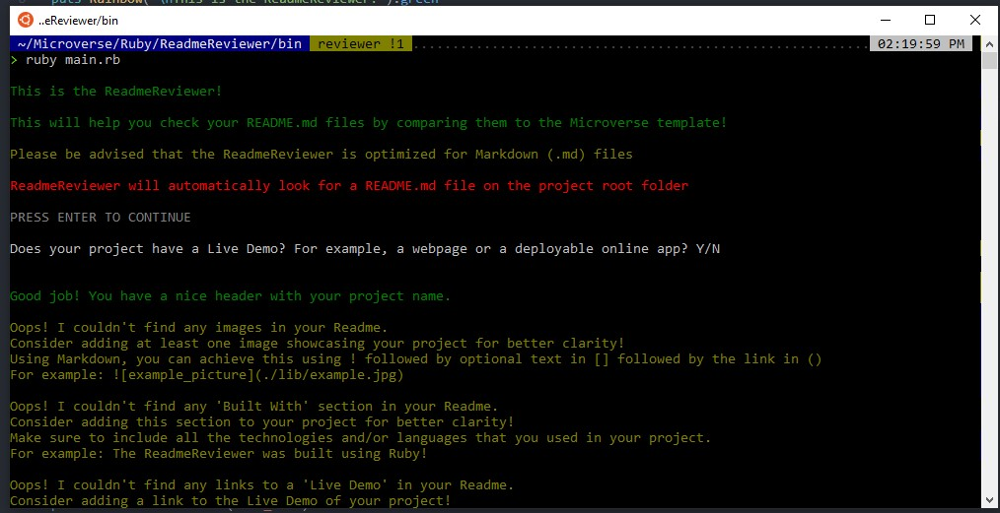

# ReadmeReviewer
A linter to review your Readme files to make them professional!

This is a "linter" that will check your readme files and compare them to the Microverse template, to help you have a professional readme in your project!

- the ReadmeReviewer is optimized for .md files (most commonly used in GitHub)
- when it finds an error, it'll provide you with helpful hints on how to fix it!
- you can also get a small tip on how to use Markdown styles depending on the error

This project was done using the template for a good Readme by [Microverse](https://github.com/microverseinc/readme-template/blob/master/README.md) as an outline on how to style the readme file overall.

## Built With

- Ruby
- RSpec
- Rainbow Gem

## Live Demo

You can download [a copy of this project so that you can check your own readme files!](https://github.com/LoxiasCam/ReadmeReviewer.git) Please see below for more information on how to set it up and run locally.

## Getting Started

- Run this command in your OS terminal: `git clone https://github.com/LoxiasCam/ReadmeReviewer.git` to get a copy of the project.
- From the root folder of the project, run the command bundle install to install any required gems that you might be lacking (most likely, you would be missing the Rainbow gem in order to colorize the text output)
- Move the README.md file that you'd like to be checked to the root folder of the project and replace this existing README.md
- That's it! You should be good to go to run the ReadmeReviewer. Please see below for more information on how to run it.
- After running bundle install, you should also have installed RSpec if you didn't have it. With this, you can run the command rspec from the root folder of this project, so that you can test the code and see if it's working!

### Prerequisites

* IRB or a Ruby parser installed in your OS terminal.
* A compatible version of Rspec, as of the time of writing, the latest RSpec version is 3.10.0
* A compatible version of Bundler in order to install and check the required gems for this project. As of the time of writing, the latest Bundler version is 2.2.10
* A text editor is not required, but is highly recommended so that you may better preview and edit the code. Popular choices include Atom or VSCode.

### Setup

* Clone the repository in order to get a copy of this project
* If you'd like to change the README reviewed by default, on main.rb, change the path on line 24

### Usage

* In your OS terminal, run the main.rb file located in the bin folder and follow the prompts on your terminal.
* Remember that you can also run rspec from the root folder of the project to run the RSpec tests for this program.

## Authors

#### Camilo Patino
GitHub: [LoxiasCam](https://github.com/LoxiasCam)

## 🤝 Contributing

Contributions, issues, and feature requests are welcome!

Feel free to check the [issues page](https://github.com/LoxiasCam/directoryCapstone/issues).

## Show your support

Give a ⭐️ if you like this project!

## Acknowledgments and special thanks

- Special shoutout to [Rainbow](https://rubygems.org/gems/rainbow/versions/3.0.0), a powerful Ruby Gem! I really enjoyed using it to colorize the different text.

## 📝 License

This project is [MIT](LICENSE) licensed.